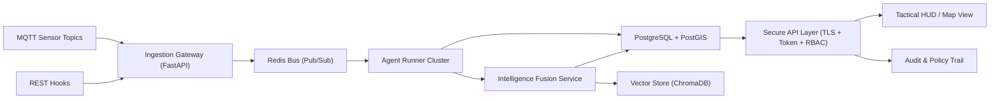

# SHAKTI V3 - Phase 1 Structural Extraction

## 1) High-Level System Architecture

The document points to a **process-isolated, event-driven microservices architecture** running as a sovereign local deployment. It is not a single monolith: the platform is split into independently supervised runtime units with Redis event transport.

- `backend/main.py`: FastAPI + WebSocket gateway (auth, TLS, validated APIs)
- `backend/agent_runner.py`: GEOINT, CYBER, SIGINT agent orchestration
- `backend/fusion_runner.py`: Fusion crew and policy/report generation
- Redis pub/sub channel for low-latency inter-process event fan-out
- Persistent stores for intelligence, policy decisions, model provenance, and reports

## 2) Core Modules

Core modules identified from the SHAKTI V3 file tree and session specs:

- Platform security: token auth, HMAC integrity, TLS, network sentinel
- Agent orchestration: watchdog, priority scheduling, graceful shutdown
- GEOINT module: sector validation, STAC simulation, rolling baseline, anomaly detection
- CYBER module: MITRE ATT&CK enrichment, chain analyzer, campaign detection
- SIGINT module: multilingual analysis, prompt sanitization, paraphrase engine
- Intelligence fusion module: multi-cluster correlation, policy escalation, report generation
- Policy engine (PRAHAAR): append-only legal audit trail
- Data platform: relational event store + vector context store + retention manager
- Real-time delivery: Redis pub/sub + WebSocket heartbeat manager
- API gateway: validated query contracts and review workflows
- Operator workflows: shift summary, review lifecycle, report retrieval
- Tactical HUD: battle map, threat ticker, resource monitor, report modal

## 3) Tech Stack (HA + Encryption at Rest/In Transit)

Recommended implementation stack (aligned to SHAKTI requirements, with HA hardening):

- Backend runtime: `Python 3.11`, `FastAPI`, `Uvicorn`, `uvloop`
- Streaming/transport: `Redis` (pub/sub) + `MQTT` broker (sensor ingress)
- Primary data plane: `PostgreSQL 16` + `PostGIS`
- Context/vector retrieval: `ChromaDB` (or pgvector if consolidating to Postgres)
- Cache/session: `Redis` with AOF + replica/sentinel for failover
- UI stack: `React + TypeScript`, `Leaflet` or `Mapbox GL`
- Packaging/deploy: `Docker Compose` or `Kubernetes` with pod anti-affinity
- Observability: `OpenTelemetry`, structured JSON logs, centralized SIEM pipeline

Encryption and HA controls:

- In transit:
  - `TLS 1.3` for API/WebSocket and internal service-to-service traffic
  - mTLS for internal control plane in clustered deployments
  - MQTT over TLS (`8883`) with client cert auth
- At rest:
  - Full-disk encryption (FileVault/LUKS)
  - Postgres data directory encryption, key management via HSM/Vault/KMS
  - Encrypted backups and signed archives
- Availability:
  - Postgres streaming replication + automatic failover
  - Redis Sentinel/Cluster
  - Process supervision/health probes for API, runner, fusion worker
  - Backpressure queues and retry policies on ingest pipelines

## 4) ERD Outline (Database Skeleton)

Primary domain entities and relationships:

- `users` (operators/analysts/service identities)
- `roles` and `permissions` (RBAC policies)
- `user_roles`, `role_permissions` (many-to-many mappings)
- `intel_observations` (normalized incoming intelligence from REST/MQTT)
- `targets` (entities under surveillance)
- `sensor_registry`, `sensor_logs` (sensor metadata + raw telemetry stream)
- `sectors` (geospatial AOIs/polygons)
- `coordinate_conflicts` (manual-review queue for target-location disagreement)
- `fusion_reports` (cross-cluster summaries and narrative outputs)
- `policy_decisions` (append-only escalation/legal audit)
- `audit_events` (request and data access lineage)

Key relationship shape:

- `users` 1..* `user_roles` *..1 `roles`
- `roles` 1..* `role_permissions` *..1 `permissions`
- `targets` 1..* `intel_observations`
- `sensor_registry` 1..* `sensor_logs`
- `intel_observations` *..1 `sectors` (by spatial containment or sector_id)
- `coordinate_conflicts` references two observations for the same `target_id`
- `fusion_reports` *..* `intel_observations` (through link table)
- `policy_decisions` references `fusion_reports` and triggering observation sets
- Every table includes `created_at`, `updated_at`, `last_modified_by` for auditing

